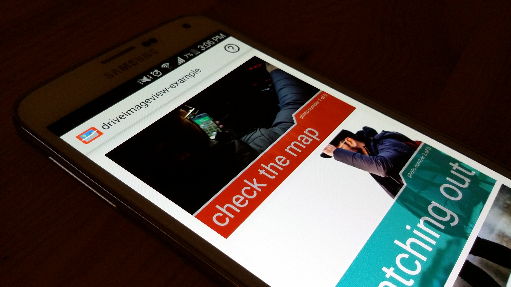
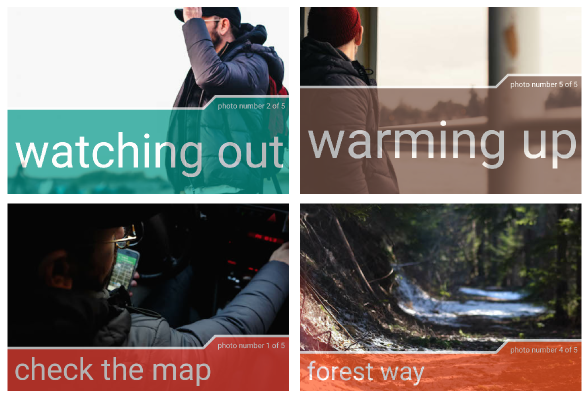

driveimageview 
==========================

## First things first

You can find my blog post about the release here: [halcyon.ch - driveimageview release] (http://halcyon.ch/driveimageview-release/)

The example application is available at the play store:

## General idea
The idea of this android library is to give the possibility to display two texts inside the imageitself. These texts could be the title or the description of the image or something else. Also there should be various settings to customise these texts and everything else.

### Examples
Here are some examples of how these DriveImageView's could look like:

### How to use it? / How to contribute?
Check the wiki for more information about [how to use](https://github.com/mrwonderman/driveimageview/wiki/Usage) and [how to contribute](https://github.com/mrwonderman/driveimageview/wiki/How-To-Contribute).

## Usage
### Gradle
This library works with gradle and will soon be available on the central maven repository. For the moment its on jCenter at [Bintray](https://bintray.com/mrwonderman/maven/driveimageview/view). Just add the following repository to your root build.gradle:

    allprojects {
        repositories {
            jcenter()
            maven { url "https://jcenter.bintray.com" }
        }
    }

Then in your app build.gradle:

    dependencies {
        // other repos ...
        compile 'ch.halcyon:driveimageview:1.0.0'
    }

### Code
After adding the gradle depedency from above you can go to your xml layout and add the following code for a squareprogressbar:

    <ch.haclyon.driveimageview.DriveImageView
      android:id="@+id/driveImageView"
      android:layout_width="wrap_content"
      android:layout_height="wrap_content"
      android:layout_centerHorizontal="true" />
    
To set some basic settings use the following java-code:

    DriveImageView driveImageView = (DriveImageView) rootView.findViewById(R.id.driveImageView);
    driveImageView.setDriveImageModel(new DriveImageModel("main text", "small text", R.drawable.image));
    driveImageView.setAlphaValue(0.7f);
